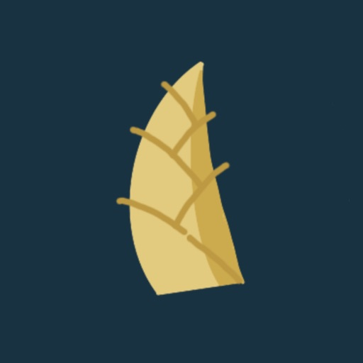
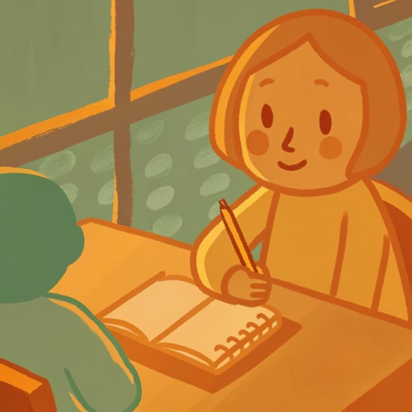
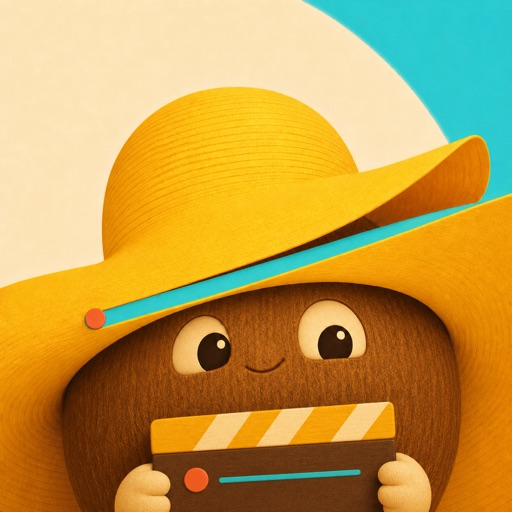
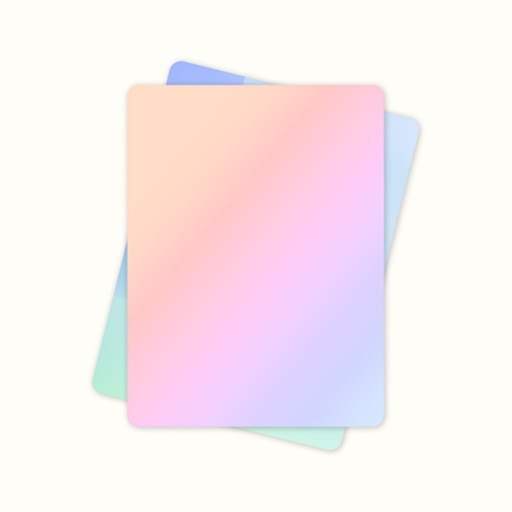
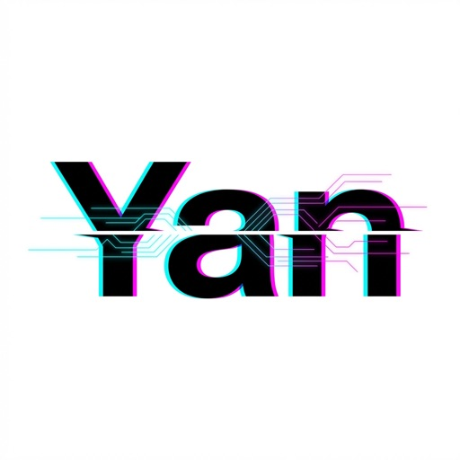
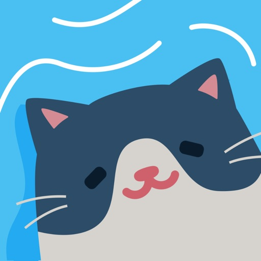
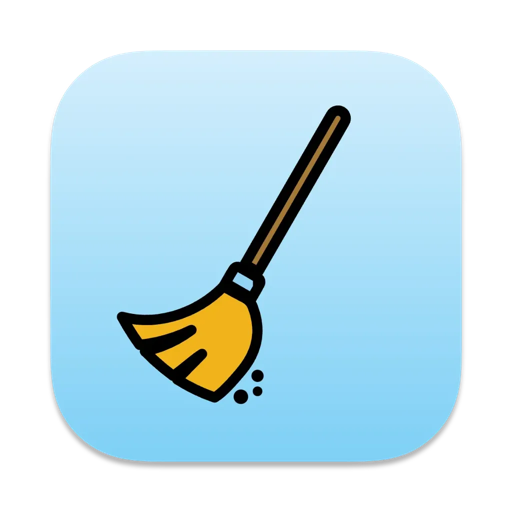

# 👋 Hi, I'm Hugo

**Indie Mobile Developer & Creator of [Yichen Studio](https://yichenlab.com)**  
*Crafting tactile, local-first, and aesthetic apps for iOS, macOS, Android & Web.*

 

&nbsp;&nbsp;
&nbsp;&nbsp;

  

### 📱 Apps & Creations

-  **Jizhi** — Classical poetry painted with traditional colors & solar terms. — [Web](https://jizhi.yichenlab.com) | [iOS](https://apps.apple.com/us/app/id1552874203) | [Android](https://play.google.com/store/apps/details?id=com.hugo.jizhi)
-  **KaChiKa** — Visual AI photo flashcards & spaced-repetition language learning. — [Web](https://kachika.app) | [iOS](https://apps.apple.com/us/app/id6739525442) | [Android](https://play.google.com/store/apps/details?id=com.hugo.photoja)
-  **CocoCut** — 1s daily vlog & video diary stitched on device. — [Web](https://cococut.app) | [iOS](https://apps.apple.com/us/app/id6791056763) | [Android](https://play.google.com/store/apps/details?id=com.hugo.yige)
-  **Kosaku** — Turn links & notes into magazine-grade cards *(App Store Editor's Choice)*. — [Web](https://kosaku.yichenlab.com) | [iOS](https://apps.apple.com/us/app/id1611559010) | [Android](https://play.google.com/store/apps/details?id=com.hugo.card)
-  **Yan** — Digital chaos engine & cyberpunk CRT scanline editor. — [Web](https://yan.yichenlab.com) | [iOS](https://apps.apple.com/us/app/id6757863100) | [Android](https://play.google.com/store/apps/details?id=com.hugo.glitch)
-  **LazySea FM** — Tidal white noise & ocean healing soundscapes. — [iOS](https://apps.apple.com/us/app/id6475624668)
-  **Cleaner For Flutter** — One-click cleanup for Mac disk space freed from Flutter build caches. — [macOS](https://apps.apple.com/us/app/id6661026876)
-  **Score** — Tactile multiplayer scoreboard for board & card games. — [iOS](https://apps.apple.com/us/app/id6615084303)

 

### 🛠 Tech & Philosophy

- **Philosophy**: Local-First · Zero Dark Patterns · Offline-Ready · Privacy-First.
- **Stack**: Flutter, Dart, Kotlin, Swift, Jetpack Compose, SwiftUI.
- **Craft**: Typography & CJK text rendering, bespoke palettes, tactile micro-interactions.

 

---

&nbsp;&nbsp;
&nbsp;&nbsp;
&nbsp;&nbsp;

 

© Yichen Studio · Crafted with care

